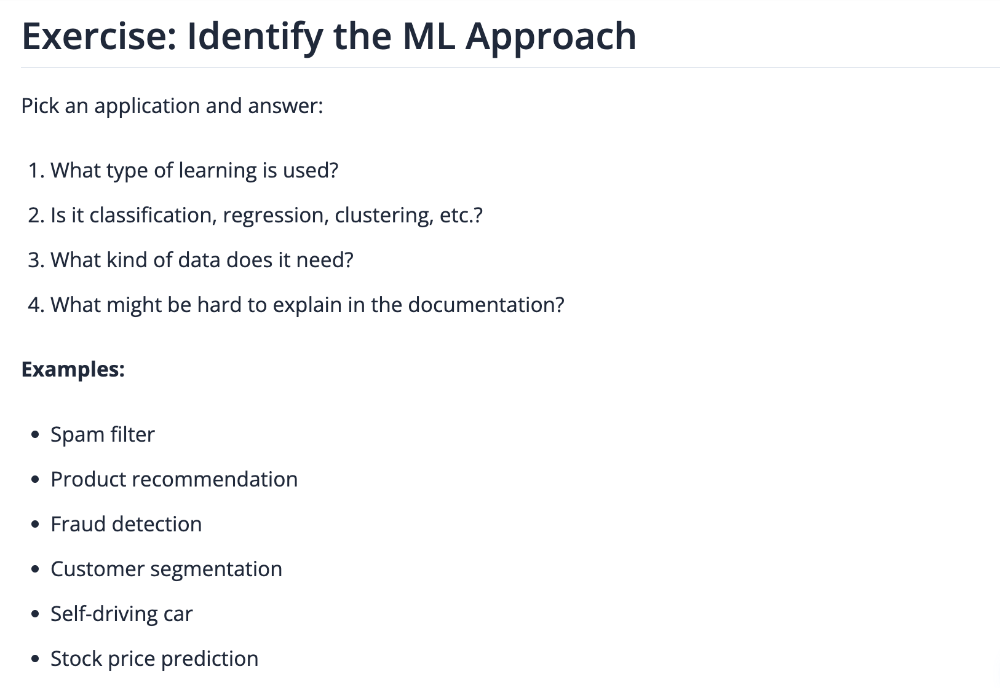

# Task Description

 

   
 

 
# 🛡️ ML Approach Overview: Fraud Detection System

This document explores the machine learning (ML) approaches commonly used in a ML based Fraud Detection System. It outlines the types of learning, data requirements, and challenges in explaining the underlying model logic to diverse readers.

## 1️.Type of Learning

Fraud detection typically applies **both supervised and unsupervised learning**, depending on the availability of labeled data.

### A. Supervised Learning

Supervised learning is most commonly used in the following cases:

 1. When there is a requirement of historical data to be labeled as **fraudulent** or **non-fraudulent.**
 2. It is used to train a model that classifies future transactions.
 3. **Examples:** 
     - Logistic Regression
     - Decision Trees
     - Neural Networks

### B. Unsupervised Learning

Unsupervised learning is used in the following cases:

 1. Applied when labeled data is unavailable or incomplete.
 2. When the focus is on detecting **anomalies or outliers.**
 3. When there is a need to discover **new fraud patterns.**
 4. **Examples:** 
     - K-Means Clustering
     - Isolation Forest
     - Autoencoders

## 2️. Task Type: Classification, Clustering, or Something Else?

|       **Task Type**       |   **Usage**         |    **Example**    |
|   **Classification**      | Most typical setup. | The primary ML task in fraud detection. Classify a transaction as **fraudulent** or **legitimate**. |
|     **Clustering**        | Sometimes for unsupervised scenarios. | Groups similar user behavior. Flags outliers that deviate from known clusters. |
| **Anomaly Detection**     | Works well with streaming data. | Identifies unusual behaviors in real-time where labeled fraud is rare. |

## 3️. Required Data Inputs

To effectively detect fraud, models rely on a wide range of **behavioral and transactional data**:

 a. **Transactional Data:**
     - Amount, time, location, merchant ID
     - Payment method, card type
 b. **User Behavior:**
     - Login frequency, typing patterns, mouse movements
     - Device fingerprinting (IP, browser, OS)
 c. **Historical Labels (for supervised learning):**
     - Flags from past incidents (e.g., marked fraud by user or investigator)
 d. **Metadata:**
     - Account age, customer ID, risk score from external systems

## 4️. Documentation Challenges: What’s Hard to Explain?

Even with strong models, some aspects are difficult to convey clearly in documentation, especially for non-technical stakeholders:

### Feature Engineering Logic

 - Complex derived metrics (e.g., *“Time since last transaction”* or *“Velocity of transactions per hour”*) may not be intuitive.
 - Readers may not understand **why** specific features improve detection.

### Model Interpretability

 - Black-box models (e.g., *deep learning*) make it hard to explain **why** a transaction was flagged.
 - Explaining decisions in **simple human terms** becomes a challenge.

### Imbalanced Datasets

 - Fraud cases are rare (often <1% of all data).
 - Requires **resampling techniques** (SMOTE, class weighting) that might confuse readers unfamiliar with ML pipelines.

### Threshold Setting

 - Precision vs. recall trade-offs impact **how sensitive** a system is to fraud.
 - Explaining why a threshold (e.g., 0.75) was chosen can feel arbitrary to non-data scientists.

### Ethical & Privacy Concerns
 
 - Must document **how personal data is used and protected**
 - Explaining compliance with data privacy laws (e.g., GDPR) is essential, yet hard to balance with technical clarity

## Conclusion

Fraud detection systems blend multiple machine learning strategies and require a mix of technical documentation and domain context. Knowing what the reader needs—whether it’s a **data scientist**, **product owner**, or **compliance officer**, is key to crafting documentation that builds trust and transparency.

