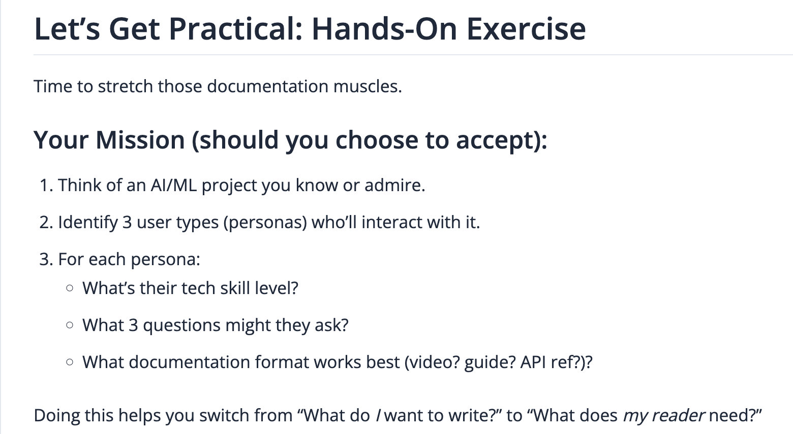

# Task Description

 

   
 

# Lung Nodule Detection & Classification – User Documentation Planning

This document outlines the User Persona Analysis and Documentation Strategy for the AI ML-based project titled: **“Lung Nodule Detection and Classification using Image Processing Techniques.”** This project was my Final Year Design Project, which I presented in my 8th semester for my Bachelors in Electrical Engineering.

## Project Overview

This system aims to assist healthcare professionals in accurately detecting and classifying lung nodules as benign or malignant using image processing techniques. It integrates computer-aided diagnosis with a user-centric interface to support clinical, research, and diagnostic workflows.

## Tools used

 - MATLAB
 - C++
 - Digital Image Processing Techniques

## Target User Personas

### 1. Radiologists  

**Skill Level:** Expert  

**Key Questions:**

- How can this tool help in accurately distinguishing between cancerous and benign nodules?
- What methods are used to reduce false positives?
- How do I extract and analyze nodules using the tool?

### 2. Pulmonologists

**Skill Level:** Expert  

**Key Questions:**

- How does this tool support clinical decision-making?
- Is the nodule classification clinically validated?
- Can I use it to explain findings to patients?

### 3. Medical Researchers  

**Skill Level:** Expert  

**Key Questions:**

- What algorithms are used for classification?
- How can I modify or extend the dataset?
- Is there a way to test model performance on new datasets?

## Recommended Documentation Formats

- **User Guide:** A detailed, step-by-step explanation of how to install, use, and interpret the results from the tool.  

- **Video Demo:** A visual walkthrough showing how the system operates on real lung scan images.  

These formats ensure that users with high technical expertise can access both in-depth understanding and quick, contextual demos of the system in action.

## ✅ Conclusion

This user analysis helps prioritize documentation content based on **user needs** instead of the writer’s perspective. Centering documentation around personas like radiologists, clinicians, and researchers ensures better usability, trust, and adoption of AI-driven medical tools.

